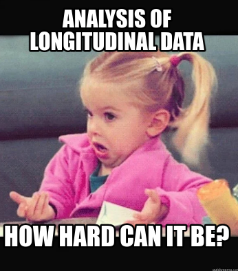
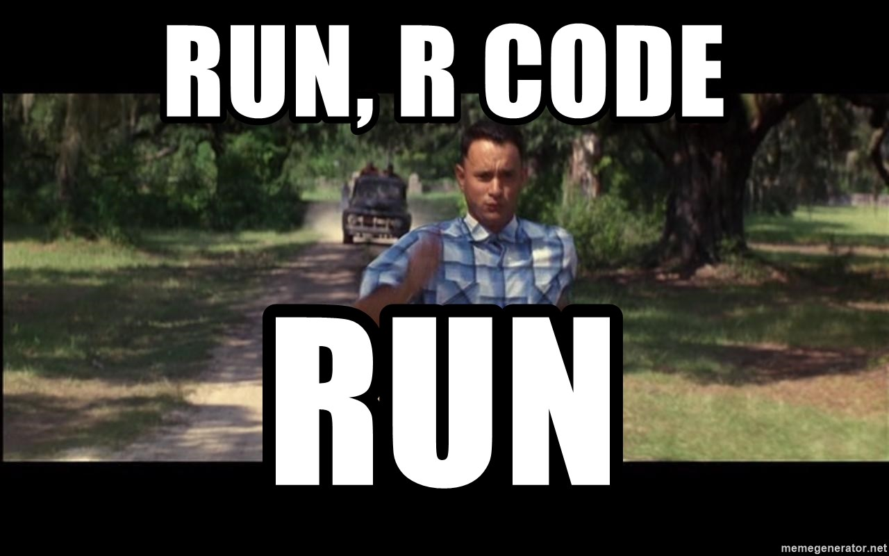

# Ch6 Analysis of longitudinal data


*Describe the work you have done this week and summarize your learning.*

- Describe your work and results clearly. 
- Assume the reader has an introductory course level understanding of writing and reading R code as well as statistical methods.
- Assume the reader has no previous knowledge of your data or the more advanced methods you are using.


```{r}
date()
```

**Here we go again!**


<center>
  


  
  {width=35% height=50%}

  
</center>


For **longitudinal data we cannot assume observations to be independent of each other**, since longitudinal data means multiple observations of the *same* individuals. For this assignment we'll first do some data wrangling to transform our data form wide form to long for. Then we'll analyse our data with linear mixed effects statistical models; a random intercept model and a random intercept and slope model.


## Libraries used for Ch6

Obs! You might need to install some packages first if you haven't used them before (see install.packages()).
```{r, message=FALSE}
#install.packages(c("tidyverse","GGally","readr", "MASS", "corrplot", "psych"))
```

Load the needed R packages before getting to work:
```{r, message=FALSE}
#load required packages
library(tidyverse)
#library(GGally)
#library(dplyr)
library(ggplot2)
#library(corrplot)
#library(stringr)
#library(psych) 
#library(FactoMineR)
library(lme4)
```


```{r, message=FALSE}

```


## Data wrangling (5p.)

See meet_and_repeat.R on [my repository](https://github.com/hsanez/IODS-project/tree/master/data/meet_and_repeat.R) for the data wrangling part.


## Data Analysis (15p.)


### 1. Analysis from ch 8 of MABS - Analysis of Longitudinal Data I: Graphical Displays and Summary Measure Approach


```{r, message=FALSE}

```

For the first part of the analysis, graphical displays and summary measure approach to longitudinal data we'll use the wrangled 'rats' dataset now found in [my repository](https://github.com/hsanez/IODS-project/tree/master/data).


```{r, message=FALSE}
# read long format data of rats
ratsL <- read.csv('rats_long.csv', row.names = 1)

# glimpse and dimensions
head(ratsL);dim(ratsL)

# structure and summary of the data
str(ratsL)
summary(ratsL)

# Convert categorical data to factors
## ID and Group
ratsL$ID <- factor(ratsL$ID)
ratsL$Group <- factor(ratsL$Group)
```

We have a dataset with 6 rats and 11 weight (grams) observations per each rat, on different weeks. The rats are divided in 3 different groups, meaning three different diets.
Our data is in a longitudinal format which means that we can study possible weight differences between the rats in these 3 different groups and the possible change of weight by time.

Let's plot the Weights of each rat by time and groups.


```{r, message=FALSE}

# Draw the plot
ggplot(ratsL, aes(x = Time, y = Weight, linetype = ID)) +
  geom_line() +
  scale_linetype_manual(values = rep(1:10, times=4)) +
  facet_grid(. ~ Group, labeller = label_both) +
  theme(legend.position = "none") + 
  scale_y_continuous(limits = c(min(ratsL$Weight), max(ratsL$Weight)))

```
The weight of each rat increases though the days. Group 1 has the most rats, group 2 and 3 include both 4 rats.
Both the baseline and final weights of the rats increase by group, group 1 having rats with the lowest weights and group 3 the highest. One rat in group 2 has the highest baseline and final weight.


**Standardizing to assess the tracking phenomenon**

Higher baseline weight may mean higher final weight. This is called the tracking phenomenon. The plots drawn earlier sufggest this might be the case in our data. We'll can assess this more clearly with plotting standardized data.

We'll standardize our data with scale():

$$standardised(x) = \frac{x - mean(x)}{ sd(x)}$$


```{r, message=FALSE}
# Standardise the variable Weight by groups´
ratsL <- ratsL %>%
  group_by(Time) %>%
  mutate(Weight_std= (scale(Weight))) %>%
  ungroup()

# Glimpse the data
head(ratsL)

# Plot again with the standardised weight
ggplot(ratsL, aes(x = Time, y = Weight_std, linetype = ID)) +
  geom_line() +
  scale_linetype_manual(values = rep(1:10, times=4)) +
  facet_grid(. ~ Group, labeller = label_both) +
  theme(legend.position = "none") + 
  scale_y_continuous(name = "standardized Weight")

```

After standardizing our data the difference between the baseline and final weights looks smaller in the plot.


**Summary graphs**

As our course material indicates, we can produce graphs showing average (mean) profiles for each group along with some indication of the variation of the observations at each time point (*the standard error of mean*):

$$se = \frac{sd(x)}{\sqrt{n}}$$


```{r, message=FALSE}

# Summary data with mean and standard error of bprs by treatment and week 
ratsLs <- ratsL %>%
  group_by(Group, Time) %>%
  summarise(mean = mean(Weight), se = (sd(Weight)/sqrt(length(Weight))) ) %>%
  ungroup()

# Glimpse the data
glimpse(ratsLs)

# Plot the mean profiles
ggplot(ratsLs, aes(x = Time, y = mean, color=Group, linetype = Group, shape = Group)) +
  geom_line() +
  scale_linetype_manual(values = c(1,2,3)) +
  geom_point(size=3) +
  scale_shape_manual(values = c(1,2,3)) +
  geom_errorbar(aes(ymin=mean-se, ymax=mean+se, linetype="1"), width=0.3) +
  # legend inside plot
  #theme(legend.position = c(0.8,0.4)) +
  scale_y_continuous(name = "mean(Weight) +/- se(Weight)")

```
There is no significant overlap between the groups, although there is definitely less difference between groups 2 and 3 compared to groups 2 or 3 to group 3. There is also the least variation between the weights of rats in group 3 and most between the weights of rats in group 2. The weight of the rats increases in each group during the study.


**Summary measure approach**

Let's look at the weight measurements after the start of the study (= we'll exclude baseline - i.e. week 1- weights). We'll calculate the mean weight for each rat, and then draw boxplots of the mean weight for each diet group. 


```{r, message=FALSE}
# Create a summary data by group and subject with mean as the summary variable (ignoring baseline week 1)
ratsL_sum <- ratsL %>%
  filter(Time > 1) %>%
  group_by(Group, ID) %>%
  summarise(Weight_mean=mean(Weight)) %>%
  ungroup()

# Glimpse the data
glimpse(ratsL_sum)

# Draw a boxplot of the mean versus diet
ggplot(ratsL_sum, aes(x = Group, y = Weight_mean, col=Group)) +
  geom_boxplot() +
  stat_summary(fun = "mean", geom = "point", shape=23, size=4, fill = "white") +
  scale_y_continuous(name = "mean(Weight), days 8-64")
```
The mean summary measure is more variable in the second treatment group and its distribution in this group is somewhat skew. All of the three groups seem to have an outlier - the mean weight of the rat is more than 1.5 times the interquartile range above the upper quartile or below the lower quartile.
These outliers might bias the conclusions from the later comparisons of the groups so we'll remove them from out analysis and redraw the boxplots.
Outlier in group 3 is within the filtering limits (min and max of the means of all groups) so we'll have to search the rat ID for that outlier to exclude it from the group.


```{r, message=FALSE}
# define outlier from group 3
g3 <- ratsL_sum %>% filter(Group==3)
out3 <- min(g3$Weight_mean)

# Create a new data by filtering the outliers
ratsL_sum2 <- ratsL_sum %>%
  filter(250 < Weight_mean & Weight_mean < 560 & Weight_mean != out3)


# Draw a boxplot of the mean versus diet
ggplot(ratsL_sum2, aes(x = Group, y = Weight_mean, col=Group)) +
  geom_boxplot() +
  stat_summary(fun = "mean", geom = "point", shape=23, size=4, fill = "white") +
  scale_y_continuous(name = "mean(Weight), days 8-64")

```
There is less within group variation after excluding the outliers and we may proceed with our analysis.


*T-test or analysis of variance (ANOVA) or analysis of covariance (ANCOVA)*

Based on our previous plots, there seems to be a difference in weights in our diet groups. We'll now test if there is a statistical difference and whether it is statistically significant.

T-test tests whether there is a statistical difference between two groups and ANOVA test whether there is a difference between three or more groups. Thus, we'll use ANOVA for our analysis.

ANOVA assumes homogeneity of variance - the variance in groups 1-3 should be similar. We'll test this with Levene's test before proceeding further with ANOVA.
```{r, message=FALSE}
# Levene's test from 'car' package
library(car)
leveneTest(Weight_mean ~ Group, ratsL_sum2)

```
The Levene's test returned a nonsignificant p value for the difference of variances between groups: we'll accept the test's null hypothesis -> there is no difference between the variance of the groups 1-3. > We may proceed with ANOVA.

```{r, message=FALSE}
# Fit the linear model with the mean Weight as the response 
fit <- lm(Weight_mean ~ Group, data = ratsL_sum2)

# Compute the analysis of variance table for the fitted model with anova()
anova(fit)

```
This shows there seems to be a significant difference in mean weights between diet groups.

However, we should take into account baseline weight to assess the differences in mean weights of groups 1-3 while accounting for the tracking phenomenon. We'll add the baseline weight from the original dataset rats and run ANCOVA.

```{r, message=FALSE}
# Load original wide form rats data
rats_og <- as_tibble(read.table("https://raw.githubusercontent.com/KimmoVehkalahti/MABS/master/Examples/data/rats.txt", header = TRUE, sep = '\t'))
rats_og$ID <- factor(rats_og$ID)
#rats_og$Group <- factor(rats_og$Group)

# Add the baseline from the original data as a new variable to the summary data
join_vars <- c("ID","WD1")
ratsL_sum3 <- ratsL_sum2 %>%
  left_join(rats_og[join_vars], by='ID') 
# Rename column
ratsL_sum3 <- ratsL_sum3 %>%
  rename('Weight_baseline' = 'WD1')

# Fit the linear model with the mean Weight as the response 
fit2 <- lm(Weight_mean ~ Weight_baseline + Group, data = ratsL_sum3)

# Compute the analysis of variance table for the fitted model with anova()
anova(fit2)

```
Baseline weight is strongly correlated with mean weight later in the study. However, diet (Group) seems to keep it's statistically significant association to weight even after taking baseline weight into account. The result is in line with our graphical overview of the dataset after exclusion of outliers.


```{r, message=FALSE}

```


### 2. Analysis from ch 9 of MABS - Analysis of Longitudinal Data II: Linear Mixed Effects Models for Normal Response Variables

In part II of this assignment we'll use the dataset BPRS, which includes psychiatric patient data. It includes a brief psychiatric rating scale (BPRS) score prior to treatment and BPRS from 8 weeks during treatment. The patients (n=40) have been randomly assigned to treatment arm 1 or 2 and we are interested whether there is a difference in BPRS scores depending on the received treatment. A lower score means less symptoms.

We'll first explore the data and then analyse it to determine whether the BPRS scores of the two treatment groups differ.


```{r, message=FALSE}
# read in the data
BPRSL <- read.csv('BPRS_long.csv', row.names=1)
head(BPRSL);dim(BPRSL)
View(BPRSL)

# Factor variables subject and treatment group
BPRSL$subject <- factor(BPRSL$subject)
BPRSL$treatment <- factor(BPRSL$treatment)

# Glimpse the data
glimpse(BPRSL)

```

From glimpsing and viewing the data we notice that in treatment arms the subjects are coded 1-20. However, these individuals with the same subject code are different individuals since all participating patients were randomized to either treatment 1 or treatment 2. To avoid mixups in our analysis we'll have to create a new individual-specific factor ID-variable.

```{r}
# New ID-variable
BPRSL <- BPRSL %>%
  mutate(ID = as.factor(paste0(subject, "_t",treatment)))

# check data
glimpse(BPRSL)
summary(BPRSL)

```


Let's plot!


```{r}
# Plot the data
ggplot(BPRSL, aes(x = week, y = bprs, group = ID,  col=treatment)) +
  geom_line(aes(linetype=treatment)) +
  scale_x_continuous(name = "Time (weeks)", breaks = seq(0,8,2)) +
  scale_y_continuous(name="BPRS") +
  theme(legend.position = "right")
```

BPRS seems to decrease during the treatment period in both treatment arms. There is no clear difference to be seen between the groups. We'll divide the plot into two separate plots by treatment.

```{r, echo=FALSE}
# plot with faceting
ggplot(BPRSL, aes(x = week, y = bprs, group = ID,  col=treatment)) +
  geom_line(aes(linetype=treatment)) +
  scale_x_continuous(name = "Time (weeks)", breaks = seq(0,8,2)) +
  scale_y_continuous(name="BPRS") +
  theme(legend.position = "right") +
  facet_grid(. ~ treatment, labeller=label_both)

```
Still, we cannot draw trustworthy conclusions of these two treatment arms affecting BPRS. Let's proceed.


**Linear Mixed Effects Models**


<center>
  
Now things are getting serious. **LET'S GO!**

  
  {width=60% height=60%}
  
</center>


*Linear model*

When fitting a linear model to our data we assume independence of the observations (here BPRS measurements). Since the data is longitudinal we know they are not independent. We'll ignore this knowledge for now and proceed with **multiple regression modeling**!


```{r}
# create a regression model BPRSL_reg
BPRSL_reg <- lm(bprs ~ week + treatment, data=BPRSL)

# print out a summary of the model
summary(BPRSL_reg)

```
BPRS score is our target variable and time (weeks) and treatment arm are our explanatory variables.
Week seems to have a statistically significant association with BPRS score. Treatment arms seem to not differ from each other when comparing BPRS scores. However, this analysis assumes independence of observations which is highly unlikely in our dataset provided we are studying repeated measures of BPRS scores (longitudinal data).

We'll now proceed to analysis where the assumption of independence within observations is not required, we'll start with running a random intercept model to assess whether there is a difference between the two treatment arms. *Fitting a random intercept model allows the linear regression fit for each individual to differ in intercept from other individuals.* The model takes into account **both fixed-effects and random effects** of our explanatory variables on our target variable.


**The Random Intercept Model**


```{r}
# Create a random intercept model
BPRSL_ref <- lmer(bprs ~ week + treatment + (1 | ID), data = BPRSL, REML = FALSE)

# Print the summary of the model
BPRSL_ref
summary(BPRSL_ref)
confint(BPRSL_ref)
```

In our dataset the minimal BPRS score is `r min(BPRSL$bprs) ` and the maximum BPRS score is `r max(BPRSL$bprs) `. Variance on ID level is high (97.4) and the standard deviation small (9.9). This confirms that there is high variance between the individual patients' BPRS scores, which tells us that their baseline symptoms are of very different levels.

One unit change in time (= 1 week passes) is associated with a decrease of 2.3 BPRS points. Individuals on treatment 2 seem to have 0.57 higher BPRS scores but its confidence intervals imply the treatment arm do not differ significantly (CI95% reach both sides of 0). These results are similar to the ones from out linear model. Only the standard error (SE) for time (week) is lower with his model and the SE for treatment group is higher with this model compared to the previous linear model. Which also insinuates that time seems to be statistically significantly associated with BPRS score and treatment arm not.

Let's fit the random intercept and random slope model to our data:


**Random Intercept and Random Slope Model**

A nice and clear quote from out material: *Fitting a random intercept and random slope model allows the linear regression fits for each individual to differ in intercept but also in slope.* This allows us to account for the individual differences in the individuals symptom (BRPS score) profiles, but also the effect of time.


```{r}
# create a random intercept and random slope model
BPRSL_ref1 <- lmer(bprs ~ week + treatment + (week | ID), data = BPRSL, REML = FALSE)

# print a summary of the model
summary(BPRSL_ref1)
confint(BPRSL_ref1)

# perform an ANOVA test on the two models to assess formal differences between them
anova(BPRSL_ref1, BPRSL_ref)

```
Adding the random slope to this model increased the inter individual variance. Treatment groups seems to stay unsignificant when it comes to BPRS over time.
The ANOVA test between our models shows that our model with the random slope argument seems to be a better fit to assess BPRS in these data.


Let's take interaction of out explanatory variables into account:


**Random Intercept and Random Slope Model with interaction**

We'll now  fit a random intercept and slope model that allows for a treatment × time interaction, and plot the result.


```{r}
# create a random intercept and random slope model with the interaction
# week * treatment = all effects and interactions of time and treatment = week + treatment + week:treatment
# random effect that allows individuals (ID) to vary randomly in terms of their baseline BPRS-value and their effects on BPRS over time (="their individual effect of Time on BPRS" = random slope)
BPRSL_ref2 <- lmer(bprs ~ week + treatment + week * treatment + (week | ID), data = BPRSL, REML = FALSE)

# print a summary of the model
summary(BPRSL_ref2)
confint(BPRSL_ref2)

# perform an ANOVA test on the two models
anova(BPRSL_ref2, BPRSL_ref1)


```

The results of our latest model (random intercept and slope, and interaction variable) seems to be similar to our second model (random intercept and slope, no interaction variable). ANOVA between the two models confirms there is no significant difference between them in our data. In summary, this time adding the interaction variable did not improve our model.

Next, we'll plot the observed BPRS values and the fitted BPRS values.
```{r}

# draw the plot of BPRSL with the observed BPRS values
ggplot(BPRSL, aes(x = week, y = bprs, group = ID, col=treatment)) +
  geom_line(aes(linetype = treatment)) +
  scale_x_continuous(name = "Time (weeks)", breaks = seq(0, 4, 8)) +
  scale_y_continuous(name = "Observed BPRS") +
  theme(legend.position = "right") +
  facet_grid(. ~ treatment, labeller=label_both)
  

# Create a vector of the fitted values
Fitted <- fitted(BPRSL_ref)
Fitted1 <- fitted(BPRSL_ref1)
Fitted2 <- fitted(BPRSL_ref2)

# Create a new column fitted to BPRSL
BPRSL <- BPRSL %>% mutate(bprs_fitted_values_BPRSL_ref = Fitted, bprs_fitted_values_BPRSL_ref1 = Fitted1, bprs_fitted_values_BPRSL_ref2 = Fitted2)
head(BPRSL)

# draw the plot of BPRSL with the Fitted values of bprs model 1
ggplot(BPRSL, aes(x = week, y = bprs_fitted_values_BPRSL_ref, group = ID, col=treatment)) +
  geom_line(aes(linetype = treatment)) +
  scale_x_continuous(name = "Time (weeks)", breaks = seq(0, 4, 8)) +
  scale_y_continuous(name = "Fitted BPRS (model 1: rnd intercept)") +
  theme(legend.position = "right") +
  facet_grid(. ~ treatment, labeller=label_both)

# draw the plot of BPRSL with the Fitted values of bprs model 2
ggplot(BPRSL, aes(x = week, y = bprs_fitted_values_BPRSL_ref1, group = ID, col=treatment)) +
  geom_line(aes(linetype = treatment)) +
  scale_x_continuous(name = "Time (weeks)", breaks = seq(0, 4, 8)) +
  scale_y_continuous(name = "Fitted BPRS (model 2: rnd intercept + slope)") +
  theme(legend.position = "right") +
  facet_grid(. ~ treatment, labeller=label_both)


# draw the plot of BPRSL with the Fitted values of bprs model 3
ggplot(BPRSL, aes(x = week, y = bprs_fitted_values_BPRSL_ref1, group = ID, col=treatment)) +
  geom_line(aes(linetype = treatment)) +
  scale_x_continuous(name = "Time (weeks)", breaks = seq(0, 4, 8)) +
  scale_y_continuous(name = "Fitted BPRS (model 3: rnd intercept + slope + interaction)") +
  theme(legend.position = "right") +
  facet_grid(. ~ treatment, labeller=label_both)

```

We can see how model 1 (random intercept) differs from model 2 (random intercept & slope) and model 3 (random intercept & slope + interaction).
Model 1 does not take into account the effect of individual effect on BPRSs over time, as do model 2 and 3. Models 2 and 3 yield similar results as we determined from our previous analysis.


```{r, message=FALSE}

```


**WOAH! DONE!** &check;
Thoughest modeling so far, but we made it! I loved the course, would redo it anytime (well..maybe earliest after at least a two week break.) I learned so much, and more than I thought I could! HUZZAH! 

**Merry Christmas!**


<center>
  
I have been **R**lightened. ┌( ಠ_ಠ)┘

  
  {width=70% height=100%}

  
</center>


## Resources

* [A beginner's guide to lmer()](https://tr.aonetrk.com/c/XxlnjyMEIVJO)
* [Kimmo Vehkalahti - MABS, R code and solutions](https://github.com/KimmoVehkalahti/MABS)
* [Tracking phenomenon]()
* [T-test vs ANOVA](https://www.raybiotech.com/learning-center/t-test-anova/)
* [Adjusting for baseline measure](https://www.raybiotech.com/learning-center/t-test-anova/)
* [ANOVA vs ANCOVA]()
* [Remember to select() while subsetting!](https://stackoverflow.com/questions/46077647/left-join-with-dplyr-bringing-just-1-field-form-the-other-table)
* [Beginner lmering](https://rstudio-pubs-static.s3.amazonaws.com/63556_e35cc7e2dfb54a5bb551f3fa4b3ec4ae.html)
* [Funny pics](https://www.memegenerator.net)
* [Tidyverse meme](https://www.r-bloggers.com/2018/03/thoughts-on-teaching-r-and-yet-another-tidyverse-intro/)
* [Kaomoji](https://www.kaomojiguru.com/party-kaomoji.html)


```{r, message=FALSE}

```